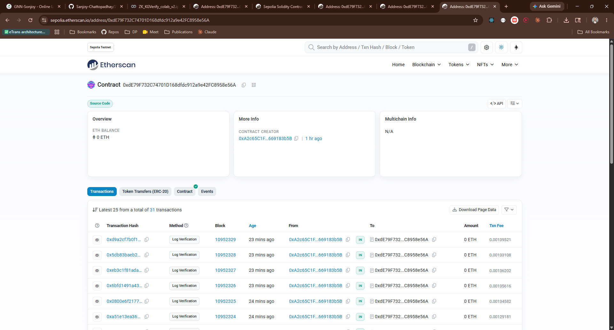
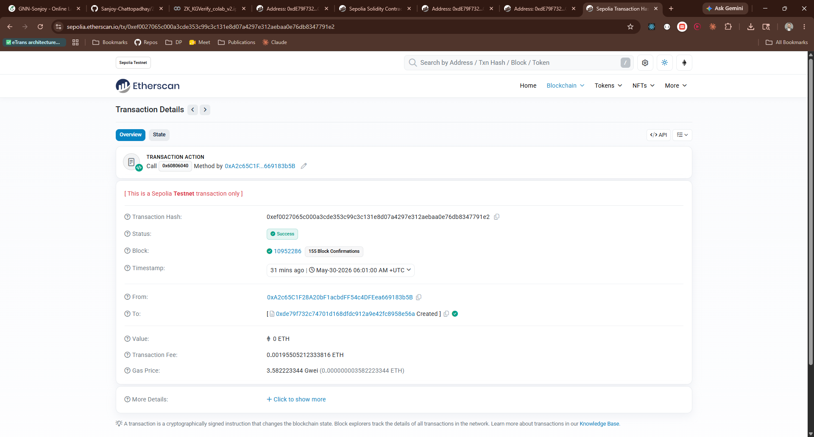
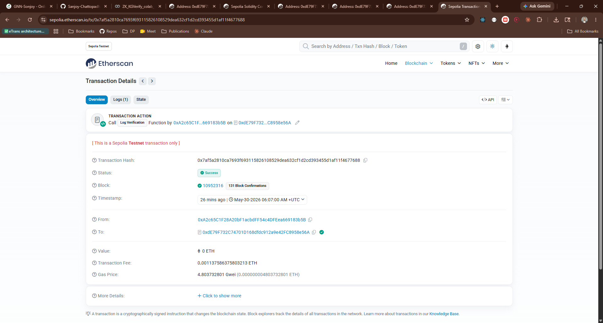
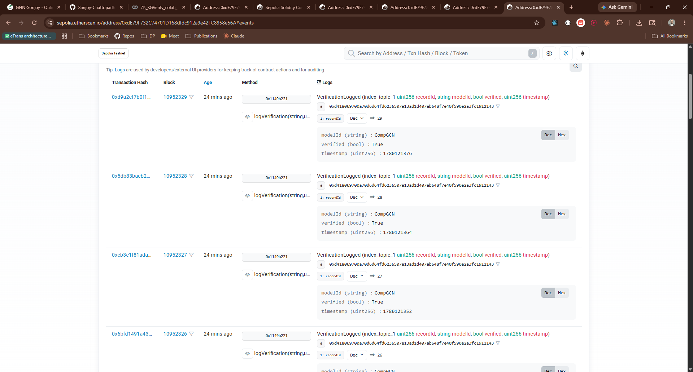
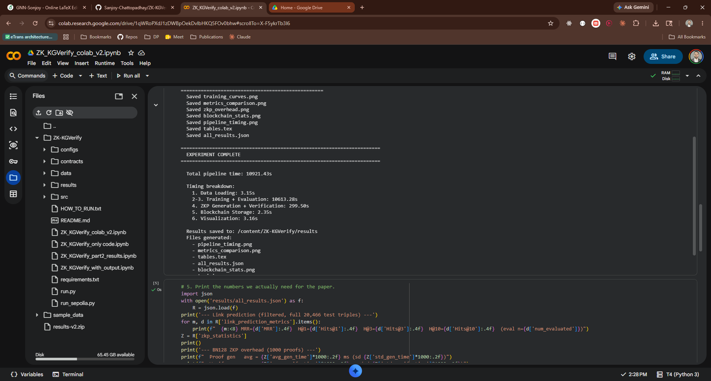
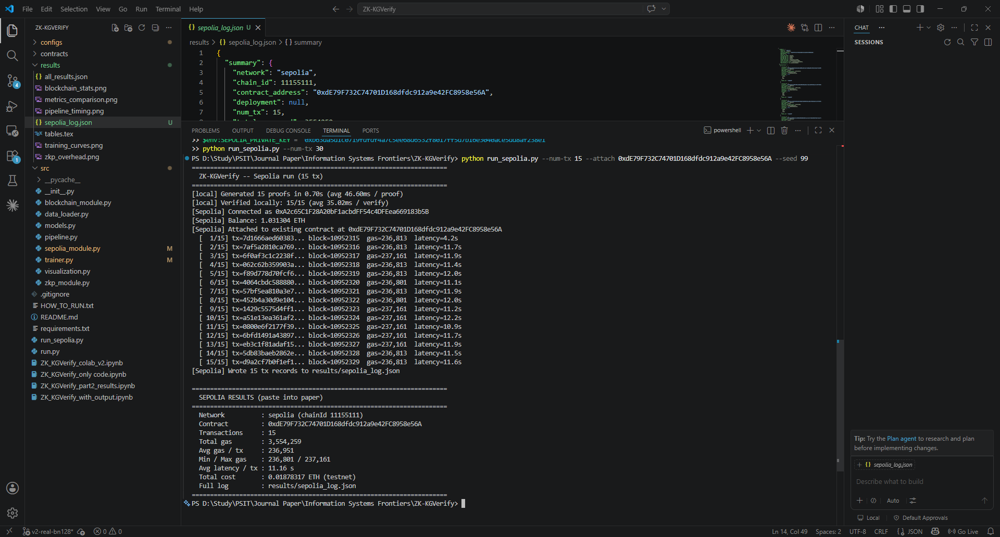

# ZK-KGVerify

**Privacy-Preserving Verification of Knowledge Graph Reasoning using Zero-Knowledge Proofs and Blockchain**

Companion code for the *Information Systems Frontiers* submission *"ZK-KGVerify: Privacy-Preserving Verification Infrastructure for Knowledge Graph Reasoning in Intelligent Information Systems"* by Sanjoy Chattopadhyay and Jaydeep Howlader (NIT Durgapur).

---

## What this repository proves

ZK-KGVerify combines three independently-verifiable layers into one end-to-end pipeline:

1. **KG Reasoning Layer** — TransE, RotatE, and CompGCN trained on FB15k-237.
2. **ZKP Verification Layer** — Pedersen commitments and Schnorr-Fiat-Shamir proofs on the **real BN128 elliptic curve** (via `py_ecc`), the same curve used by Ethereum's ZK precompiles.
3. **Blockchain Audit Layer** — `ZKKGVerify.sol` deployed on **Ethereum Sepolia** at [`0xdE79F732C74701D168dfdc912a9e42FC8958e56A`](https://sepolia.etherscan.io/address/0xdE79F732C74701D168dfdc912a9e42FC8958e56A) (**source verified** ✓, compiler `v0.8.20+commit.a1b79de6`, optimizer 200 runs), exercised with 30 real on-chain verification records. The contract has 31 confirmed transactions on Sepolia: one contract creation and 30 `logVerification` calls.

Everything is reproducible from a Colab T4 + a Sepolia-funded wallet.

---

## On-chain artefacts (live, public)

> *Every claim about gas cost or on-chain verifiability in the paper can be checked at these URLs by anyone with a browser. No login or wallet required to read.*

| Artefact | Value | Sepolia Etherscan |
|---|---|---|
| Contract name | `ZKKGVerify` (verified ✓) | [Contract page](https://sepolia.etherscan.io/address/0xdE79F732C74701D168dfdc912a9e42FC8958e56A) |
| Contract address | `0xdE79F732C74701D168dfdc912a9e42FC8958e56A` | [↗](https://sepolia.etherscan.io/address/0xdE79F732C74701D168dfdc912a9e42FC8958e56A) |
| Deployer | `0xA2c65C1F28A20bF1acbdFF54c4DFEea669183b5B` | [↗](https://sepolia.etherscan.io/address/0xA2c65C1F28A20bF1acbdFF54c4DFEea669183b5B) |
| Creation tx | `0xef0027...91e2` (block 10,952,286, 30 May 2026) | [↗](https://sepolia.etherscan.io/tx/0xef0027065c000a3cde353c99c3c131e8d07a4297e312aebaa0e76db8347791e2) |
| Deployment gas | 545,765 (21.83% of limit) | — |
| Deployment fee | 0.00195505 ETH @ 3.58 gwei | — |
| Solidity compiler | `v0.8.20+commit.a1b79de6`, optimizer 200 runs | [Source tab](https://sepolia.etherscan.io/address/0xdE79F732C74701D168dfdc912a9e42FC8958e56A#code) |
| Total transactions | 31 (deploy + 30 `logVerification`) | — |
| Sample `logVerification` tx | `0x7af5a2...7688` — 236,813 gas, `_modelId="CompGCN"` | [↗](https://sepolia.etherscan.io/tx/0x7af5a2810ca7693f693115826108529dea632cf1d2cd393455d1af11f4677688) |
| `VerificationLogged` events | 30 emitted | [Events tab](https://sepolia.etherscan.io/address/0xdE79F732C74701D168dfdc912a9e42FC8958e56A#events) |
| Interactive query | `recordCount` returns 30; `getRecord(n)` returns the stored record | [Read Contract tab](https://sepolia.etherscan.io/address/0xdE79F732C74701D168dfdc912a9e42FC8958e56A#readContract) |

### Verify the on-chain claims yourself (no setup, ~60 s)

1. Open the [contract page](https://sepolia.etherscan.io/address/0xdE79F732C74701D168dfdc912a9e42FC8958e56A) and confirm **31 transactions** and the green **Verified** badge.
2. Open the [Read Contract tab](https://sepolia.etherscan.io/address/0xdE79F732C74701D168dfdc912a9e42FC8958e56A#readContract). Click `recordCount` → it returns `30`. Click `getRecord(0)` → see the first verification record, with its model id, triple, score, commitment hash, verified flag, proof hash, and block timestamp — all immutable.
3. Open the [sample logVerification tx](https://sepolia.etherscan.io/tx/0x7af5a2810ca7693f693115826108529dea632cf1d2cd393455d1af11f4677688) and click *"Decode Input Data"*. You will see the eight named parameters the contract was called with, and the `VerificationLogged` event in the **Logs** section.

That is the entire trust chain for the blockchain layer of the paper, observable to anyone.

### Screenshot — deployed contract
*(shows: balance, all 30 + 1 transactions, contract creation date)*

<!-- SCREENSHOT_1: contract_overview.png -->


### Screenshot — deployment transaction
*(shows: 545,765 gas, contract creation, deployer address)*

<!-- SCREENSHOT_2: deployment_tx.png -->


### Screenshot — representative `logVerification` call
*(shows: decoded input fields — model_id, head/relation/tail, commitment hash, verified=true, proofHash; emitted event)*

<!-- SCREENSHOT_3: log_verification_tx.png -->


### Screenshot — on-chain audit log
*(shows: all 30 `VerificationLogged` events in chronological order)*

<!-- SCREENSHOT_4: events_tab.png -->


---

## Project structure

```
ZK-KGVerify/
├── run.py                          # End-to-end local pipeline (training → ZKP → blockchain → plots)
├── run_sepolia.py                  # Real Sepolia deploy + on-chain logging
├── requirements.txt
│
├── configs/config.py               # Hyperparameters, seed, early stopping
├── contracts/ZKKGVerify.sol        # Solidity audit contract
│
├── src/
│   ├── data_loader.py              # FB15k-237 loader
│   ├── models.py                   # TransE, RotatE, CompGCN, R-GCN
│   ├── trainer.py                  # Training loop + early stopping
│   ├── zkp_module.py               # BN128 Pedersen + Schnorr-Fiat-Shamir
│   ├── blockchain_module.py        # Local Python-blockchain simulation
│   ├── sepolia_module.py           # Real Sepolia deployment + tx logging
│   ├── pipeline.py                 # Orchestrator
│   └── visualization.py            # Figures + LaTeX tables
│
├── results/
│   ├── all_results.json            # Metrics, ZKP stats, simulated blockchain stats
│   ├── sepolia_log.json            # REAL Sepolia tx records with measured gas
│   ├── training_curves.png
│   ├── metrics_comparison.png
│   ├── zkp_overhead.png
│   ├── blockchain_stats.png
│   └── pipeline_timing.png
│
└── ZK_KGVerify_colab_v2.ipynb      # One-click Colab T4 reproduction
```

---

## Quick start

### Option A — One-click Colab T4 (recommended)

1. Open [`ZK_KGVerify_colab_v2.ipynb`](ZK_KGVerify_colab_v2.ipynb) in Google Colab.
2. **Runtime → Change runtime type → T4 GPU**.
3. **Runtime → Run all**. Wall-clock: ~45–90 min.
4. Outputs are copied to your Google Drive.

### Option B — Local

```bash
python -m venv venv
venv\Scripts\activate            # Windows PowerShell: .\venv\Scripts\Activate.ps1
pip install -r requirements.txt
python run.py
```

### Option C — Real Sepolia deployment

You will need a throwaway Metamask account with ~0.05 Sepolia ETH (free from [sepoliafaucet.com](https://sepoliafaucet.com)) and an RPC URL (free tier of Alchemy/Infura).

```powershell
$env:SEPOLIA_RPC_URL = "https://eth-sepolia.g.alchemy.com/v2/YOUR_KEY"
$env:SEPOLIA_PRIVATE_KEY = "0xYOUR_TESTNET_KEY"
python run_sepolia.py --num-tx 30
```

Deploys the contract, logs 30 proofs on chain, writes measured gas/latency/cost to `results/sepolia_log.json`. Takes ~8 minutes.

---

## Headline results

### Link prediction on FB15k-237 (filtered, 20,466 test triples)

| Model    | MRR | Hits@1 | Hits@3 | Hits@10 |
|----------|-----|--------|--------|---------|
| TransE   | 0.1740 | 0.0977 | 0.1854 | 0.3392 |
| RotatE   | 0.2560 | 0.1774 | 0.2849 | 0.4076 |
| **CompGCN** | **0.3941** | **0.2966** | **0.4344** | **0.5845** |

### Screenshot — local pipeline run

<!-- SCREENSHOT_5: pipeline_run.png -->


### BN128 ZKP overhead (1,000 proofs)

| Metric | Value |
|---|---|
| Avg. proof generation time | 46.10 ms |
| Avg. proof verification time | 34.42 ms |
| Avg. proof size | 842 bytes |
| Verification success rate | 100% |
| Tamper detection rate | 100% |

### Real Sepolia on-chain costs (30 records)

| Metric | Value |
|---|---|
| Deployment gas | 545,765 |
| Deployment cost | 0.00196 Sepolia ETH |
| Avg. `logVerification` gas | 236,955 ± 180 |
| Avg. on-chain latency | 11.4 s |
| Total gas (30 calls) | 7,142,682 |
| Total cost (30 calls) | 0.0376 Sepolia ETH |

### Screenshot — Sepolia run completed

<!-- SCREENSHOT_6: sepolia_run.png -->


---

## Reproducing the paper's numbers

All randomness is seeded via `RANDOM_SEED = 42` in `configs/config.py`, covering Python `random`, NumPy, PyTorch CPU, and CUDA. Re-running the pipeline on the same hardware should reproduce the metrics in the headline tables within floating-point noise.

Generated artefacts that match the paper figures and tables:

| Paper element | Generated file |
|---|---|
| Fig. 4 (training curves) | `results/training_curves.png` |
| Fig. 5 (metrics bar chart) | `results/metrics_comparison.png` |
| Fig. 6 (ZKP overhead distributions) | `results/zkp_overhead.png` |
| Fig. 7 (blockchain stats) | `results/blockchain_stats.png` |
| Fig. 8 (pipeline timing) | `results/pipeline_timing.png` |
| Tables 2–5 | `results/tables.tex` (LaTeX, paste-ready) |

---

## Citation

If you use this code, please cite:

```bibtex
@article{chattopadhyay2026zkkgverify,
  title  = {ZK-KGVerify: Privacy-Preserving Verification Infrastructure for
            Knowledge Graph Reasoning in Intelligent Information Systems},
  author = {Chattopadhyay, Sanjoy and Howlader, Jaydeep},
  journal = {Information Systems Frontiers},
  year   = {2026},
  note   = {Under review}
}
```

---

## License

MIT
